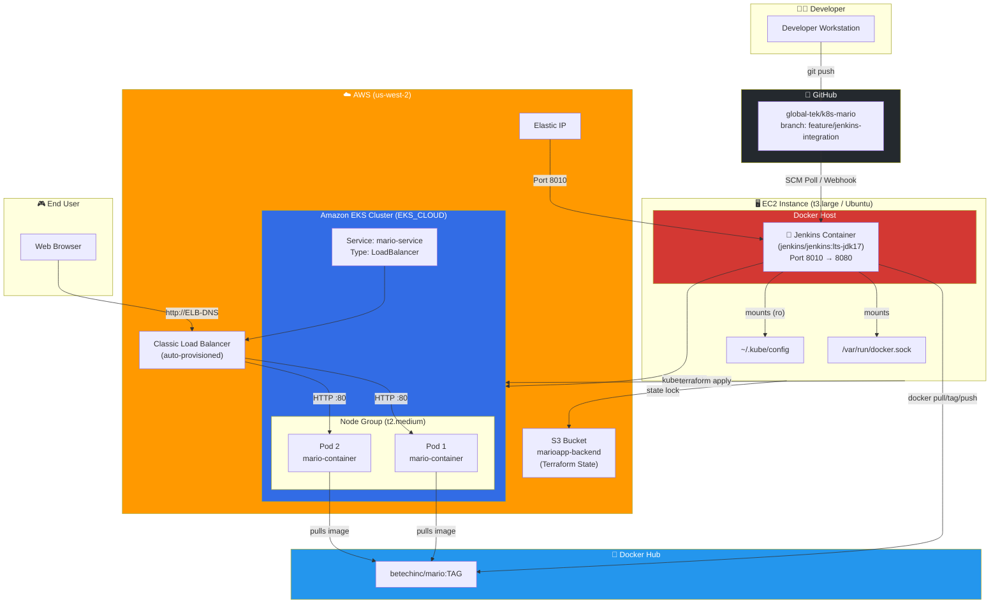
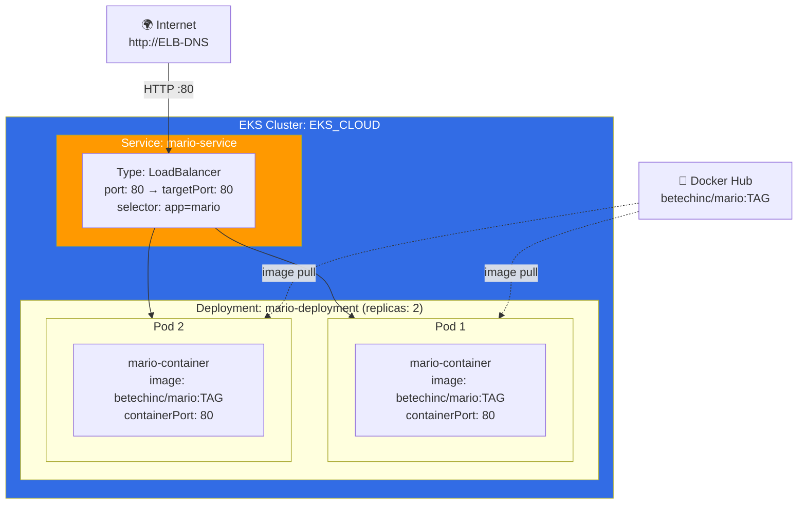
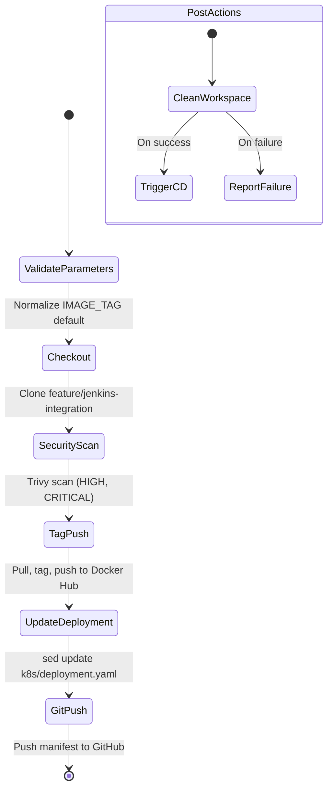
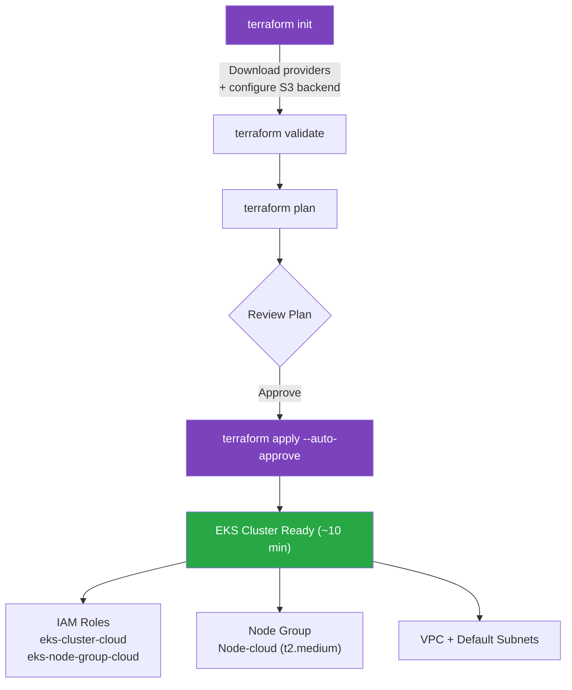

# 🎮 K8s-Mario — Super Mario on Kubernetes with Jenkins CI/CD

> **Repository:** `global-tek/k8s-mario`
> **Branch:** `feature/jenkins-integration`
> **Owner:** betechinc

Deploy the classic Super Mario game on **Amazon EKS** using **Terraform** for infrastructure provisioning, a **Dockerized Jenkins** container for CI/CD, and separate **CI and CD pipelines** for build and deployment.

---

## Table of Contents

- [Project Overview](#project-overview)
- [Architecture](#architecture)
- [Repository Structure](#repository-structure)
- [CI/CD Pipeline Flow](#cicd-pipeline-flow)
- [Kubernetes Resource Diagram](#kubernetes-resource-diagram)
- [Prerequisites](#prerequisites)
- [Workshop Steps](#workshop-steps)
  - [Step 1 — Launch Ubuntu EC2 Instance](#step-1--launch-ubuntu-ec2-instance)
  - [Step 2 — Create and Attach IAM Role](#step-2--create-and-attach-iam-role)
  - [Step 3 — Allocate Elastic IP](#step-3--allocate-elastic-ip)
  - [Step 4 — Create S3 Bucket for Terraform State](#step-4--create-s3-bucket-for-terraform-state)
  - [Step 5 — Clone Repo and Install Dependencies](#step-5--clone-repo-and-install-dependencies)
  - [Step 6 — Deploy EKS Cluster with Terraform](#step-6--deploy-eks-cluster-with-terraform)
  - [Step 7 — Pull, Tag, and Push Mario Docker Image](#step-7--pull-tag-and-push-mario-docker-image)
  - [Step 8 — Configure CI/CD Deployment Files](#step-8--configure-cicd-deployment-files)
  - [Step 9 — Build and Launch Jenkins Container](#step-9--build-and-launch-jenkins-container)
  - [Step 10 — Build and Deploy the Mario App](#step-10--build-and-deploy-the-mario-app)
- [Jenkins Pipelines in Detail](#jenkins-pipelines-in-detail)
  - [CI Pipeline — mario-app-build](#ci-pipeline--mario-app-build)
  - [CD Pipeline — mario-app-deployment](#cd-pipeline--mario-app-deployment)
- [Kubernetes Manifests](#kubernetes-manifests)
- [Jenkins Container (Dockerfile)](#jenkins-container-dockerfile)
- [Terraform Configuration (EKS-TF)](#terraform-configuration-eks-tf)
- [Deploying Alternative Mario Images](#deploying-alternative-mario-images)
- [Cleanup](#cleanup)
- [Troubleshooting](#troubleshooting)
- [References](#references)

---

## Project Overview

This project deploys a containerized **Super Mario Bros HTML5** web game onto **Amazon EKS** (Elastic Kubernetes Service). The `feature/jenkins-integration` branch extends the base project with a full **CI/CD pipeline** powered by a custom **Dockerized Jenkins** container running on the same EC2 instance.

The architecture separates concerns into two Jenkins pipeline jobs:

- **`mario-app-build`** (CI) — Scans the image with Trivy, tags and pushes it to Docker Hub, updates the K8s deployment manifest with the new version, and auto-triggers the CD job.
- **`mario-app-deployment`** (CD) — Lints K8s manifests with kubeconform, deploys to EKS via kubectl, and verifies the rollout.

### Key Features

- **Separated CI/CD Pipelines** — Build and deploy are independent Jenkins jobs with automatic chaining
- **Dockerized Jenkins** — Custom Jenkins container with Trivy, kubeconform, kubectl, AWS CLI, and Docker pre-installed
- **Security Scanning** — Trivy scans Docker images for HIGH and CRITICAL vulnerabilities before deployment
- **Manifest Linting** — kubeconform validates K8s YAML before applying to the cluster
- **Infrastructure as Code** — EKS cluster fully provisioned with Terraform, state stored in S3
- **Parameterized Builds** — IMAGE_TAG parameter allows versioned deployments (e.g., `1.0`, `2.0`)
- **Elastic IP** — Persistent public IP for Jenkins access across EC2 restarts
- **GitOps-style Updates** — CI pipeline commits updated image tags back to the repo

---

## Architecture



---

## Repository Structure

```
k8s-mario/
├── ci/                              # Continuous Integration
│   ├── docker-compose.yaml          # Docker Compose to launch Jenkins container
│   └── Jenkins/
│       ├── Dockerfile               # Custom Jenkins image (Trivy, kubeconform, kubectl, awscli, Docker)
│       └── Jenkinsfile              # CI pipeline: scan → tag → push → update manifest → trigger CD
├── cd/                              # Continuous Deployment
│   └── Jenkinsfile                  # CD pipeline: lint → deploy → verify
├── k8s/                             # Kubernetes manifests
│   ├── deployment.yaml              # Deployment (2 replicas, betechinc/mario)
│   └── service.yaml                 # Service (LoadBalancer, port 80)
├── EKS-TF/                          # Terraform IaC for EKS
│   ├── main.tf                      # EKS cluster, IAM roles, node group, launch template
│   ├── provider.tf                  # AWS + Kubernetes provider config (us-west-2)
│   └── backend.tf                   # S3 remote state backend (marioapp-backend)
├── docs/                            # Documentation
│   ├── JENKINS_SETUP.md             # Jenkins ↔ EKS communication setup guide
│   ├── DEPLOY_SIMILAR_MARIO_IMAGE.md # How to deploy alternative Mario images
│   ├── TROUBLESHOOTING_STORY.md     # Troubleshooting journal
│   └── update-aws-auth.sh           # Script to update EKS aws-auth ConfigMap
├── script.sh                        # Dependency installer (Terraform, kubectl, AWS CLI, Docker, Docker Compose)
└── .gitignore                       # Ignores .terraform*, *.tfstate, *.zip, aws*, kubectl
```

---

## CI/CD Pipeline Flow

```mermaid
flowchart LR
    subgraph CI["mario-app-build (CI Pipeline)"]
        A["📥 Checkout<br/>feature/jenkins-integration"] --> B["✅ Validate<br/>Parameters"]
        B --> C["🛡️ Security Scan<br/>(Trivy)"]
        C --> D["🏷️ Tag & Push<br/>Docker Image"]
        D --> E["📝 Update<br/>k8s/deployment.yaml"]
        E --> F["🔀 Git Push<br/>updated manifest"]
    end

    subgraph CD["mario-app-deployment (CD Pipeline)"]
        G["📥 Checkout<br/>feature/jenkins-integration"] --> H["✅ Validate<br/>Parameters"]
        H --> I["🔍 K8s Manifest<br/>Lint (kubeconform)"]
        I --> J["🚀 Deploy to<br/>Kubernetes"]
        J --> K["🔄 kubectl set image<br/>+ rollout status"]
        K --> L["✅ Verify<br/>Deployment"]
    end

    F -->|"auto-trigger<br/>build job"| G

    style CI fill:#D33833,color:#fff
    style CD fill:#326CE5,color:#fff
```



---

## Kubernetes Resource Diagram



---

## Prerequisites

| Requirement | Details |
|---|---|
| **AWS Account** | With permissions for EKS, EC2, IAM, VPC, S3 |
| **EC2 Instance** | Ubuntu 22.04, **t3.large** (or t3.xlarge), **16 GB** storage |
| **IAM Role** | `Mario` role with `AdministratorAccess` attached to EC2 |
| **Elastic IP** | Allocated and associated with the EC2 instance |
| **S3 Bucket** | `marioapp-backend` in `us-west-2` for Terraform state |
| **Docker Hub Account** | To push tagged Mario images |
| **GitHub PAT** | Token with `workflow`, `write:packages`, `delete:packages`, `admin:org`, `admin:public_key` scopes |

---

## Workshop Steps

### Step 1 — Launch Ubuntu EC2 Instance

1. Navigate to **EC2 Dashboard** → **Launch Instance**
2. Name: `Mario`
3. AMI: **Ubuntu Server 22.04 LTS**
4. Instance type: **t3.large** (2 vCPU, 8 GB RAM)
5. Storage: **16 GB** gp2
6. Security group: Default (ensure inbound rules for ports 22, 8010, 80)
7. Launch the instance

### Step 2 — Create and Attach IAM Role

1. Go to **IAM** → **Roles** → **Create Role**
2. Trusted entity: **AWS Service → EC2**
3. Policy: **AdministratorAccess** (for workshop purposes only)
4. Role name: `Mario`
5. Attach to EC2: **Actions** → **Security** → **Modify IAM Role** → select `Mario`

### Step 3 — Allocate Elastic IP

1. Go to **EC2** → **Elastic IPs** → **Allocate Elastic IP address**
2. Associate it with the Mario EC2 instance
3. This ensures a persistent public IP across instance restarts

### Step 4 — Create S3 Bucket for Terraform State

1. Navigate to **S3** → **Create bucket**
2. Bucket name: `marioapp-backend`
3. Region: `us-west-2`
4. Create with default settings

### Step 5 — Clone Repo and Install Dependencies

```bash
# Clone and switch to the feature branch
git clone https://github.com/Aj7Ay/k8s-mario.git
cd k8s-mario
git checkout -b feature/jenkins-integration

# Install Terraform, kubectl, AWS CLI, Docker, Docker Compose
sudo chmod +x script.sh
./script.sh

# Grant Docker permissions
sudo usermod -aG docker $USER
newgrp docker

# Verify installations
docker --version
aws --version
kubectl version --client
terraform --version
```

**Generate a GitHub Personal Access Token** and set your remote:

```bash
git remote set-url origin https://<USERNAME>:<TOKEN>@github.com/<USERNAME>/k8s-mario.git
```

**Create a `.gitignore`** to prevent tracking large/binary files:

```
.terraform*
*.tfstate
*.zip
aws*
kubectl
```

**Update configuration files** for your environment:

```bash
# Update S3 bucket name and region in:
#   EKS-TF/backend.tf
#   EKS-TF/provider.tf
# Update image name in:
#   k8s/deployment.yaml  (set to your Docker Hub username)

git add deployment.yaml && git commit -m 'updated image to correct repo'
cd EKS-TF/
git add backend.tf provider.tf && git commit -m 'updated s3 backend and region'
git push
```

### Step 6 — Deploy EKS Cluster with Terraform

```bash
cd EKS-TF/
terraform init
terraform validate
terraform plan
terraform apply --auto-approve    # ~10 minutes
```

After provisioning, update kubeconfig:

```bash
aws eks update-kubeconfig --name EKS_CLOUD --region us-west-2
```

### Step 7 — Pull, Tag, and Push Mario Docker Image

```bash
docker login -u <YOUR_DOCKERHUB_USERNAME>

docker pull sevenajay/mario:latest
docker tag sevenajay/mario:latest <YOUR_DOCKERHUB_USERNAME>/mario:latest
docker push <YOUR_DOCKERHUB_USERNAME>/mario:latest
```

### Step 8 — Configure CI/CD Deployment Files

The repo is organized into `ci/`, `cd/`, and `k8s/` directories (already present on the `feature/jenkins-integration` branch). If starting from the base repo:

```bash
cd ~/k8s-mario
mkdir k8s ci cd ci/Jenkins
mv deployment.yaml service.yaml k8s/
```

The key files to create/verify are:

- `ci/docker-compose.yaml` — Launches the custom Jenkins container
- `ci/Jenkins/Dockerfile` — Builds Jenkins with Trivy, kubeconform, kubectl, AWS CLI, Docker
- `ci/Jenkins/Jenkinsfile` — CI pipeline (mario-app-build)
- `cd/Jenkinsfile` — CD pipeline (mario-app-deployment)

### Step 9 — Build and Launch Jenkins Container

```bash
cd ~/k8s-mario/ci
export DOCKER_GID=$(getent group docker | cut -d: -f3)
docker-compose up -d
```

Verify the container is running:

```bash
docker ps
```

Access Jenkins at: `http://<ELASTIC_IP>:8010/`

Get the initial admin password:

```bash
docker exec jenkins cat /var/jenkins_home/secrets/initialAdminPassword
```

**Configure Jenkins:**

1. Install suggested plugins
2. Install additional plugins: **Pipeline Stage View**, **Docker Pipeline**, **Kubernetes Credentials**, **Kubernetes CLI**
3. Add credentials:
   - **Secret text** → ID: `github` (GitHub PAT)
   - **Username/Password** → ID: `dockerhub-credentials` (Docker Hub login)
   - **Secret file** → ID: `k8s-config-id` (contents of `~/.kube/config`)
4. Create pipeline job **`mario-app-build`**: SCM → Git → branch `*/feature/jenkins-integration` → Script Path: `ci/Jenkins/Jenkinsfile`
5. Create pipeline job **`mario-app-deployment`**: SCM → Git → branch `*/feature/jenkins-integration` → Script Path: `cd/Jenkinsfile`

### Step 10 — Build and Deploy the Mario App

1. Go to **mario-app-build** → **Build with Parameters**
2. Set `IMAGE_TAG` to `1.0` (or any version)
3. Click **Build**
4. On success, `mario-app-deployment` is auto-triggered
5. Access the game via the LoadBalancer URL:

```bash
kubectl get svc mario-service -o jsonpath='{.status.loadBalancer.ingress[0].hostname}'
```

Open `http://<LOADBALANCER_DNS>` in your browser (HTTP, not HTTPS).

---

## Jenkins Pipelines in Detail

### CI Pipeline — mario-app-build

**Script Path:** `ci/Jenkins/Jenkinsfile`



| Stage | Description |
|---|---|
| **Validate Parameters** | Normalizes `DOCKER_IMAGE` and `IMAGE_TAG`; defaults to `betechinc/mario:latest` |
| **Checkout** | Clones `feature/jenkins-integration` from `global-tek/k8s-mario` |
| **Security Scan (Trivy)** | Scans image for HIGH/CRITICAL CVEs; reports but does not fail the build |
| **Tag & Push Docker Image** | Pulls latest, re-tags with `IMAGE_TAG`, pushes both tagged and latest |
| **Update Deployment File** | Uses `sed` to update `k8s/deployment.yaml` with new image tag, commits and pushes to GitHub |
| **Post: success** | Auto-triggers `mario-app-deployment` with `APP_IMAGE` parameter |

### CD Pipeline — mario-app-deployment

**Script Path:** `cd/Jenkinsfile`

| Stage | Description |
|---|---|
| **Validate Parameters** | Normalizes `APP_IMAGE`; defaults to `betechinc/mario:latest` |
| **Checkout** | Clones `feature/jenkins-integration` from `global-tek/k8s-mario` |
| **K8s Manifest Lint** | Validates `k8s/deployment.yaml` and `k8s/service.yaml` with `kubeconform -strict` |
| **Deploy to Kubernetes** | Applies manifests via `kubectl apply`, then `kubectl set image` with the parameterized image |
| **Verify Deployment** | Confirms rollout status and lists running pods with `app=mario` label |

---

## Kubernetes Manifests

### k8s/deployment.yaml

```yaml
apiVersion: apps/v1
kind: Deployment
metadata:
  name: mario-deployment
spec:
  replicas: 2
  selector:
    matchLabels:
      app: mario
  template:
    metadata:
      labels:
        app: mario
    spec:
      containers:
      - name: mario-container
        image: betechinc/mario:latest
        ports:
        - containerPort: 80
```

### k8s/service.yaml

```yaml
apiVersion: v1
kind: Service
metadata:
  name: mario-service
spec:
  type: LoadBalancer
  selector:
    app: mario
  ports:
    - protocol: TCP
      port: 80
      targetPort: 80
```

---

## Jenkins Container (Dockerfile)

The custom Jenkins image at `ci/Jenkins/Dockerfile` extends `jenkins/jenkins:lts-jdk17` with the following tools pre-installed:

| Tool | Purpose |
|---|---|
| **Trivy** | Container image vulnerability scanning |
| **kubeconform** | Kubernetes manifest validation/linting |
| **kubectl** | Kubernetes cluster management |
| **AWS CLI** | AWS service interaction and EKS token generation |
| **Docker** | Build and push container images (via mounted Docker socket) |

The `ci/docker-compose.yaml` mounts the host's Docker socket and kubeconfig into the container, mapping Jenkins to port **8010** on the host.

---

## Terraform Configuration (EKS-TF)

| File | Purpose |
|---|---|
| `main.tf` | EKS cluster (`EKS_CLOUD`), IAM roles (`eks-cluster-cloud`, `eks-node-group-cloud`), node group (`Node-cloud`, t2.medium, 1–2 nodes), launch template |
| `provider.tf` | AWS provider (us-west-2), Kubernetes provider wired to EKS cluster endpoint |
| `backend.tf` | S3 backend (`marioapp-backend` bucket, key `EKS/terraform.tfstate`) |



---

## Deploying Alternative Mario Images

The CD pipeline accepts an `APP_IMAGE` parameter, so you can deploy any compatible container image without modifying manifests.

1. Open Jenkins → **mario-app-deployment** → **Build with Parameters**
2. Set `APP_IMAGE` to the desired image (e.g., `pengbai/docker-supermario:latest`)
3. Run the build

The pipeline will use `kubectl set image` to update the running deployment in-place.

---

## Cleanup

```bash
# Delete Kubernetes resources
kubectl delete service mario-service
kubectl delete deployment mario-deployment

# Destroy EKS infrastructure
cd ~/k8s-mario/EKS-TF
terraform destroy --auto-approve

# Stop Jenkins container
cd ~/k8s-mario/ci
docker-compose down

# Release Elastic IP (via AWS Console)
# Delete S3 bucket (via AWS Console)
# Terminate EC2 instance
```

> **Important:** Delete the Kubernetes LoadBalancer service before running `terraform destroy` to avoid orphaned AWS ELBs.

---

## Troubleshooting

| Issue | Solution |
|---|---|
| Jenkins can't reach EKS cluster | Verify kubeconfig is mounted: `docker exec jenkins cat /var/jenkins_home/.kube/config` |
| `kubectl` not found in Jenkins | Rebuild the Jenkins image: `cd ci && docker-compose build --no-cache && docker-compose up -d` |
| Trivy scan times out | This is expected on first run while downloading the vulnerability DB; re-run the build |
| Pods stuck in `ImagePullBackOff` | Verify Docker Hub image exists and is public: `docker pull betechinc/mario:TAG` |
| LoadBalancer has no external IP | Wait 2–3 minutes for AWS ELB provisioning; check security group rules |
| Terraform state lock error | Run `terraform force-unlock <LOCK_ID>` |
| `docker-compose` permission denied | Run `sudo usermod -aG docker $USER && newgrp docker` |
| Jenkins build fails at git push | Verify GitHub PAT is configured as `github` credential (Secret text) in Jenkins |
| Can't access Jenkins UI | Ensure Elastic IP is associated and security group allows inbound on port **8010** |
| EKS `Unauthorized` errors | Update kubeconfig: `aws eks update-kubeconfig --name EKS_CLOUD --region us-west-2` |

For detailed troubleshooting narratives, see [`docs/TROUBLESHOOTING_STORY.md`](docs/TROUBLESHOOTING_STORY.md).

---

## References

| Resource | Link |
|---|---|
| Original k8s-mario Repository | [github.com/Aj7Ay/k8s-mario](https://github.com/Aj7Ay/k8s-mario) |
| Mario App CI/CD Workshop Guide | `docs/` directory and companion PDF |
| Amazon EKS Documentation | [docs.aws.amazon.com/eks](https://docs.aws.amazon.com/eks/latest/userguide/what-is-eks.html) |
| Terraform AWS EKS | [registry.terraform.io/providers/hashicorp/aws](https://registry.terraform.io/providers/hashicorp/aws/latest/docs) |
| Jenkins Pipeline Syntax | [jenkins.io/doc/book/pipeline](https://www.jenkins.io/doc/book/pipeline/) |
| Trivy Scanner | [aquasecurity.github.io/trivy](https://aquasecurity.github.io/trivy/) |
| kubeconform | [github.com/yannh/kubeconform](https://github.com/yannh/kubeconform) |
| Docker Hub — Mario Image | [hub.docker.com/r/betechinc/mario](https://hub.docker.com/r/betechinc/mario) |
| Jenkins Kubernetes CLI Plugin | [plugins.jenkins.io/kubernetes-cli](https://plugins.jenkins.io/kubernetes-cli/) |
| Docker Compose Docs | [docs.docker.com/compose](https://docs.docker.com/compose/) |

---

## License

This project is provided for **educational and workshop purposes**. The original Super Mario Docker image is sourced from `sevenajay/mario:latest` on Docker Hub.

---

<p align="center">
  <b>🕹️ Let's Go back to 1985 and play the game like children! 🕹️</b>
</p>
